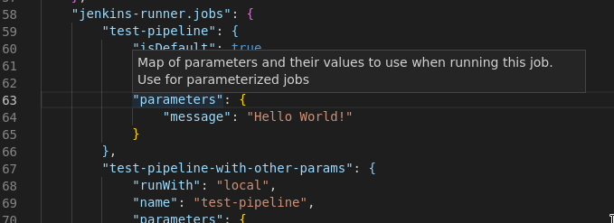
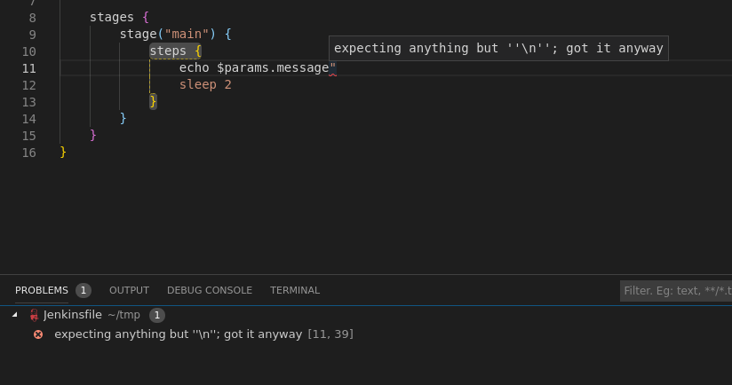
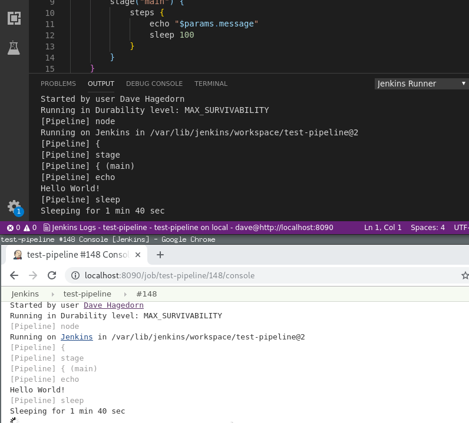
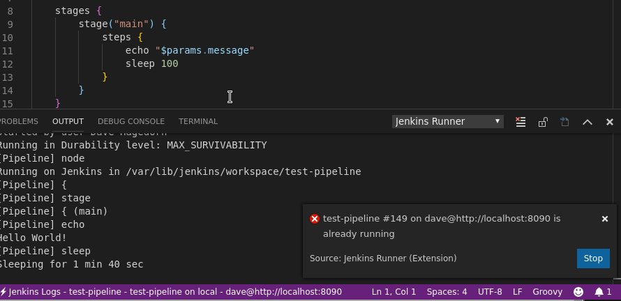

#  Jenkins Runner

Extension to run Jenkins Pipeline scripts from within VS Code


Jenkins Runner can launch any opened file as the Jenkins Pipeline script (declarative or scripted) for a given Jenkins job/project.


:warning::warning::warning:

The configuration of the Jenkins job used to run the script will be over-written by this extension.  Suggest using a scratch/test job.

:warning::warning::warning:

# Getting Started

## Add Jenkins Users and Hosts

The extensions needs to know which Jenkins host(s) you are going to launch jobs on - and the Jenkins user(s) you will use to do so.

These are configured through the `jenkins-runner.hostConfigs` property in user settings

This is a map of friendly names (used for VS Code menus/UI) to host configs:

```json
"jenkins-runner.hostConfigs": {
    "local": {
        "url": "http://localhost:8090"
    },
    "local-secure": {
        "url": "http://localhost:8090",
        "user": "dave"
    },
    "master": {
        "url": "http://jenkins.mycompany.com",
        "user": "dave",
        "password": "password"
    }
}
```

At a minimum, each hostConfig entry requires a `url` field.  This assumes a host with no authentication.

Assuming the host requires authentication, the `user` field is provided.  `password` supplies the user's password.

If `password` is omitted, you will be prompted once per user, per VS Code session, for that user's password.  This password is then cached until VS Code is closed, or until the `Forget temporary passwords` command is invoked.

## Add Jobs & Their Parameters

The extension also needs to know which Jenkins job(s) you will use to actually run a Jenkins script.  These are configured through the `jenkins-runner.jobs` property in user settings.  This is a map of friendly names (used for VS Code menus/UI) to job configs:

:warning::warning::warning:

The Jenkins-side configuration of a job will be over-written by this extension.  Suggest using a scratch/test job.

:warning::warning::warning:

```json
"jenkins-runner.jobs": {
    "test 1 - defaults": {
        "isDefault": true,
        "runWith": ["local", "master"],
        "name": "test-pipeline",
    },
    "test 1 - other params": {
        "runWith": "local",
        "name": "test-pipeline",
        "parameters": {
            "message": "Hello World!"
        }
    }
}
```

Each job entry requires:

* `runWith` - a name, or an array of names, from `jenkins-runner.hostConfigs`.  This is the host(s) this job exists on.  This is useful if you have, say, local dev and remote Jenkins instances
* `name` - the name of the job as it is exists on the Jenkins host(s).  This job must already exist on the expected Jenkins host(s)

The following field are optional:

* `isDefault` - this should be set for at most one job.  This job is used by the `Run Pipeline Script on Default Job` command.  This saves you needing to chose a job every time you want to run a script - as would be done when using the `Run Pipeline Script On...` command
* `parameters` - a dictionary of the parameters configured for this job

## Jenkins Setup

The jobs referenced by `jenkins-runner.jobs` must already exist on the Jenkins host(s) referenced by those jobs.  You or your Jenkins admin must do this step outside this extension.  These should be configured as a Pipeline Job.

The Jenkins user of the `hostConfig`(s) referenced by a job must have permission to configure and launch that job.

## Run Pipeline Scripts

Any open editor in VS Code can be launched as a Pipeline Job:

* `Run Pipeline Script On...` - shows a picker to chose the job config to use when launching the editor's contents as a Pipeline Job.  If this job has more than one host in its `runWith` field, you will also need to pick the host
* `Run Pipeline Script On Default Job` - same as above, but automatically choses the job with `isDefault` set to true

The console output of a running job is shown in VS Code's output console, under `Jenkins Runner`, and an indicator is shown in the status bar.  Clicking this indicator will also show the output console.  The command `Show Pipeline Log` also shows this console.

Any Groovy/Pipeline errors encountered during the run should be highlighted and reported in VS Code's Problems tab

A running job can be stopped using the `Stop Pipeline Run` command.

Any cached passwords can be reset/forgotten using the `Forget Temporary Passwords` command.

Lastly, extension debug logs are written to the `Jenkins Runner - Debug Log` output console.

# Features

## Parameter Support

Each job configuration supports arbitrary build parameters.



You can add multiple job configurations to test a script against different sets of parameters

## Multiple jobs & Hosts

A script can be launched under any configured job...


On any Jenkins host configured for that job


This is helpful if you want to test a script against different jobs, or run a script against a job on both dev and production Jenkins instances.

## Error Highlighting

Compilation errors in your pipeline script are parsed from the Jenkins build output and shown in-line and in the Errors panel



## Streaming Build Output

As your build runs, the output is streamed to VS Code



## Authentication

If your Jenkins instance is secured, you can configure usernames and passwords in user settings.  If you don't want to store the password for a Jenkins user, you can leave it blank and will be prompted once per VS Code session, per user.


## Build Control

Long running builds can be stopped from within VS Code



# Known Issues

* Compilation errors are highlighted at the starting line+column to the end of the same line
  * The extension can determine where a compilation error starts but does not know where it ends, so assumes to the end of the current line
* A max of one job can be running at any time (from within VS Code)
  * The extension somewhat supports multiple jobs, but the UI and command handlers have not been updated to support this
  * Is a consideration for future releases if there is interest

# Release Notes

See [CHANGELOG.md](CHANGELOG.md)
